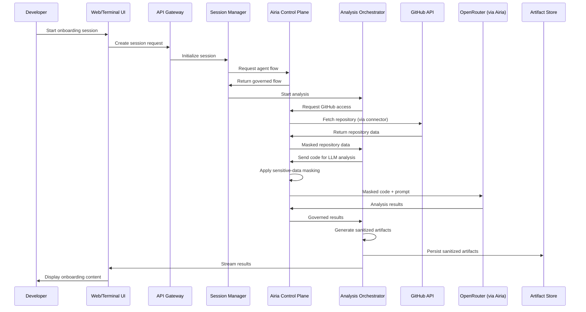
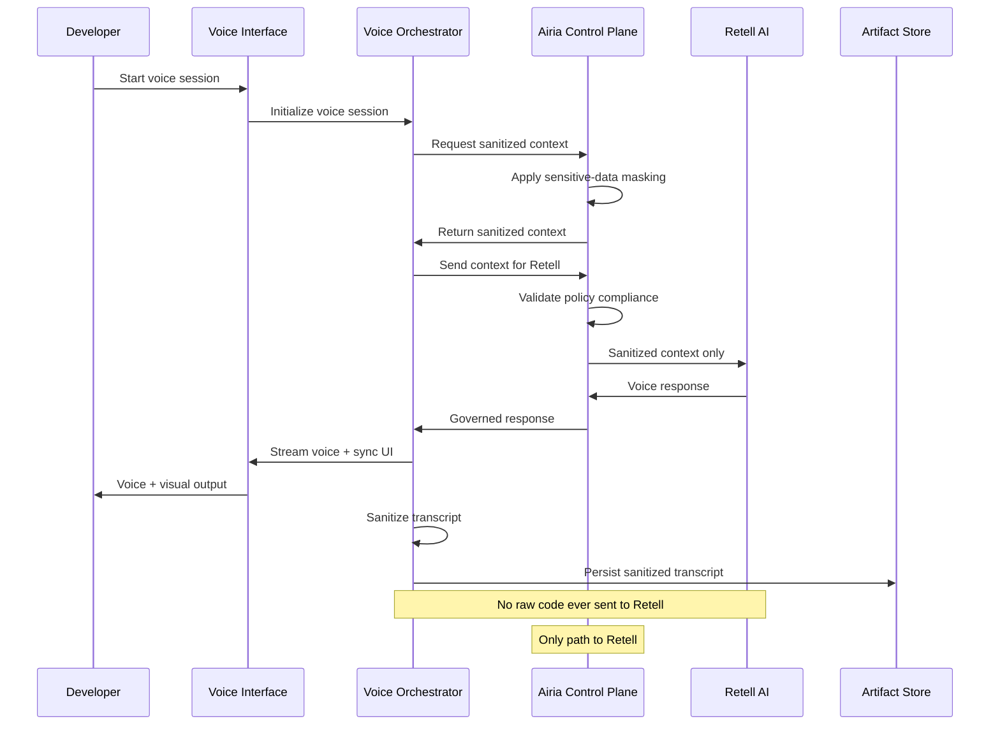
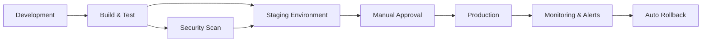

# Design Document

## Overview

The Codebase Onboarding Agent is an enterprise-grade web application that provides AI-powered codebase analysis and interactive onboarding experiences. The system integrates multiple specialized services orchestrated through Airia's enterprise control plane to deliver secure, governed, and cost-effective onboarding sessions with optional voice interaction via Retell AI.

### Key Design Principles

1. **Security First**: All data flows through Airia's policy engine with sensitive-data masking, encryption at rest and in transit, and strict tenant isolation
2. **Sanitization by Default**: Raw code never persists beyond 24 hours; all long-term artifacts are sanitized
3. **Graceful Degradation**: System remains partially functional when non-critical services are unavailable
4. **Cost Transparency**: Real-time cost tracking with configurable limits and automatic termination
5. **Governance Centralization**: All LLM traffic, model selection, and policy enforcement through Airia
6. **Reproducibility**: Versioned agent flows and configurations enable deterministic re-runs

## Architecture

### High-Level Architecture

```mermaid
graph TB
    subgraph "Client Layer"
        WebUI[Web UI]
        TerminalUI[Terminal UI Component]
        VoiceUI[Voice Interface]
    end
    
    subgraph "API Gateway Layer"
        Gateway[API Gateway]
        Auth[Auth Service<br/>SSO/OIDC/MFA]
        RBAC[RBAC Enforcement]
    end
    
    subgraph "Application Layer"
        SessionMgr[Session Manager]
        AnalysisOrch[Analysis Orchestrator]
        VoiceOrch[Voice Orchestrator]
        CostTracker[Cost Tracker]
    end
    
    subgraph "Airia Control Plane"
        AiriaPolicy[Policy Engine]
        AiriaRouter[Multi-LLM Router]
        AiriaConnectors[Data Connectors]
        AiriaFlows[Agent Flow Manager]
    end
    
    subgraph "External Services"
        GitHub[GitHub API]
        OpenRouter[OpenRouter]
        Modal[Modal]
        Retell[Retell AI]
    end
    
    subgraph "Data Layer"
        SessionDB[(Session DB)]
        ArtifactStore[(Artifact Store)]
        Cache[(Cache Layer)]
        AuditLog[(Audit Logs)]
    end
    
    WebUI --> Gateway
    TerminalUI --> Gateway
    VoiceUI --> Gateway
    
    Gateway --> Auth
    Gateway --> RBAC
    Gateway --> SessionMgr
    
    SessionMgr --> AnalysisOrch
    SessionMgr --> VoiceOrch
    SessionMgr --> CostTracker
    
    AnalysisOrch --> AiriaFlows
    VoiceOrch --> AiriaPolicy
    
    AiriaFlows --> AiriaRouter
    AiriaPolicy --> AiriaRouter
    AiriaRouter --> AiriaConnectors
    
    AiriaConnectors --> GitHub
    AiriaConnectors --> OpenRouter
    AiriaConnectors --> Modal
    
    VoiceOrch --> AiriaPolicy
    AiriaPolicy --> Retell
    
    Note right of AiriaConnectors: Only path to<br/>OpenRouter/Modal
    Note right of AiriaPolicy: Sanitizes context<br/>before Retell
    
    SessionMgr --> SessionDB
    AnalysisOrch --> ArtifactStore
    AnalysisOrch --> Cache
    RBAC --> AuditLog
    CostTracker --> AuditLog
```

### Data Flow Architecture

#### Text-Based Analysis Flow



#### Voice Interaction Flow



### Component Responsibilities

#### Client Layer
- **Web UI**: React-based SPA with minimalistic developer-focused theme
- **Terminal UI Component**: Interactive terminal interface with command history, autocomplete, and accessibility
- **Voice Interface**: WebRTC-based voice client for Retell AI integration

#### API Gateway Layer
- **API Gateway**: Request routing, rate limiting, and protocol translation
- **Auth Service**: SSO/OIDC integration, MFA enforcement, session token management
- **RBAC Enforcement**: Role-based access control for Developer, Collaborator, Team Lead, Administrator

#### Application Layer
- **Session Manager**: Lifecycle management for onboarding sessions, state persistence, concurrent session limits, Airia downtime handling
- **Analysis Orchestrator**: Coordinates AST parsing, architecture analysis, data flow tracing, code execution
- **Voice Orchestrator**: Routes all context through Airia before Retell AI, synchronizes voice with visual outputs
- **Cost Tracker**: Single source of truth for cost limits and enforcement across all session types (text, voice, animation)

#### Airia Control Plane
- **Policy Engine**: Enforces per-tenant policies, sensitive-data masking, risk guardrails
- **Multi-LLM Router**: Dynamic model selection, fallback handling, A/B testing
- **Data Connectors**: Secure credential management for GitHub, OpenRouter, Modal
- **Agent Flow Manager**: Versioned workflow definitions, deployment, rollback

#### Data Layer
- **Session DB**: PostgreSQL for session state, user profiles, learning profiles
- **Artifact Store**: S3-compatible storage for sanitized artifacts only (interactive scripts, templates, transcripts)
- **Cache Layer**: Redis for Intermediate Artifacts (repository metadata, embeddings, temporary analysis results) with 24-hour TTL
- **Audit Logs**: Append-only storage for compliance and governance tracking

## Components and Interfaces

### Core Components

#### 1. Authentication & Authorization Module

**Purpose**: Secure user authentication and role-based access control

**Interfaces**:
```typescript
interface AuthService {
  // SSO/OIDC authentication
  initiateSSO(provider: string, tenantId: string): Promise<AuthURL>;
  completeSSO(code: string, state: string): Promise<AuthToken>;
  
  // MFA management
  enrollMFA(userId: string, method: MFAMethod): Promise<MFASecret>;
  verifyMFA(userId: string, code: string): Promise<boolean>;
  
  // Session management
  createSession(userId: string, metadata: SessionMetadata): Promise<SessionToken>;
  validateSession(token: string): Promise<SessionInfo>;
  revokeSession(sessionId: string): Promise<void>;
  listActiveSessions(userId: string): Promise<SessionInfo[]>;
}

interface RBACService {
  // Permission checks
  checkPermission(userId: string, resource: Resource, action: Action): Promise<boolean>;
  getUserRole(userId: string, tenantId: string): Promise<Role>;
  
  // Role management
  assignRole(userId: string, role: Role, tenantId: string): Promise<void>;
  revokeRole(userId: string, tenantId: string): Promise<void>;
  
  // Audit logging
  logAccessAttempt(userId: string, resource: Resource, action: Action, granted: boolean): Promise<void>;
}

type Role = 'Developer' | 'Collaborator' | 'TeamLead' | 'Administrator';
type MFAMethod = 'TOTP' | 'WebAuthn';
```

**Key Design Decisions**:
- SSO via OIDC for enterprise integration
- MFA required for Administrators, optional for others
- Session tokens expire after 8 hours of inactivity
- All permission checks logged for audit compliance

#### 2. Session Management Module

**Purpose**: Manage onboarding session lifecycle, state, and concurrency

**Interfaces**:
```typescript
interface SessionManager {
  // Session lifecycle
  createSession(config: SessionConfig): Promise<Session>;
  getSession(sessionId: string): Promise<Session>;
  updateSession(sessionId: string, updates: Partial<SessionState>): Promise<void>;
  terminateSession(sessionId: string, reason: string): Promise<void>;
  
  // Collaboration
  shareSession(sessionId: string, permissions: CollaboratorPermissions): Promise<ShareLink>;
  joinSession(shareLink: string, userId: string): Promise<Session>;
  listCollaborators(sessionId: string): Promise<Collaborator[]>;
  
  // Airia downtime handling
  checkAiriaAvailability(): Promise<boolean>;
  enterReadOnlyMode(): Promise<void>;
  exitReadOnlyMode(): Promise<void>;
  isReadOnlyMode(): boolean;
}

interface SessionConfig {
  userId: string;
  tenantId: string;
  repositoryUrl: string;
  analysisScope: AnalysisScope;
  modelPreference?: string;
  outputFormat: 'text' | 'animation';
  voiceEnabled: boolean;
  randomSeed?: number;
}

interface SessionState {
  status: 'initializing' | 'analyzing' | 'paused' | 'completed' | 'terminated';
  progress: number;
  currentCost: number;
  artifacts: ArtifactReference[];
  learningProfile: LearningProfileUpdate[];
}
```

**Key Design Decisions**:
- Session state persisted to PostgreSQL for recovery
- Maximum concurrent sessions enforced per tenant
- Cost tracking delegated to CostTracker (single source of truth)
- Graceful termination with 5-minute warning
- Airia downtime handling: block new LLM/agent work, allow read-only access to existing sanitized artifacts
- Downtime mode clearly surfaced in UI and logged for monitoring

#### 3. Airia Integration Module

**Purpose**: Interface with Airia control plane for governance and routing

**Interfaces**:
```typescript
interface AiriaClient {
  // Agent flow management
  getAgentFlow(flowName: string, version?: string): Promise<AgentFlow>;
  executeAgentFlow(flowId: string, input: FlowInput): Promise<FlowOutput>;
  
  // Policy enforcement
  checkPolicy(tenantId: string, operation: Operation): Promise<PolicyDecision>;
  maskSensitiveData(content: string, tenantId: string): Promise<string>;
  
  // Multi-LLM routing
  routeLLMRequest(request: LLMRequest, tenantId: string): Promise<LLMResponse>;
  getFallbackModel(primaryModel: string, tenantId: string): Promise<string>;
  
  // Configuration management
  exportConfiguration(tenantId: string): Promise<AiriaConfig>;
  importConfiguration(config: AiriaConfig): Promise<void>;
}

interface AgentFlow {
  id: string;
  name: string;
  version: string;
  steps: FlowStep[];
  policies: Policy[];
  fallbackFlow?: string;
}

interface PolicyDecision {
  allowed: boolean;
  reason?: string;
  alternatives?: string[];
  maskedContent?: string;
}
```

**Key Design Decisions**:
- All LLM requests routed exclusively through Airia, no direct access to OpenRouter
- AiriaConnectors is the only path to OpenRouter and Modal
- Sensitive-data masking applied before external transmission
- Agent flows versioned for reproducibility
- Automatic fallback on policy violations or service failures
- When Airia is unavailable, all new agent/LLM operations blocked

#### 4. Analysis Engine Module

**Purpose**: Perform code analysis, architecture extraction, and data flow tracing

**Interfaces**:
```typescript
interface AnalysisEngine {
  // Repository analysis
  analyzeRepository(repo: Repository, scope: AnalysisScope): Promise<AnalysisResult>;
  parseAST(files: SourceFile[]): Promise<ASTNode[]>;
  fallbackAnalysis(files: SourceFile[]): Promise<PatternAnalysis>;
  
  // Architecture analysis
  identifyArchitecturePatterns(ast: ASTNode[]): Promise<ArchitecturePattern[]>;
  analyzeGitHistory(repo: Repository, depth: number): Promise<HistoryInsight[]>;
  
  // Data flow tracing
  traceDataFlow(entryPoint: CodeLocation, maxDepth: number): Promise<DataFlowPath[]>;
  identifyDataStructures(ast: ASTNode[]): Promise<DataStructure[]>;
  
  // Code execution
  executeCodeSample(code: string, sandbox: SandboxConfig): Promise<ExecutionResult>;
}

interface AnalysisResult {
  architecture: ArchitecturePattern[];
  features: FeatureLocation[];
  dataFlows: DataFlowPath[];
  executionResults: ExecutionResult[];
  sanitizedArtifacts: SanitizedArtifact[];
}

interface SandboxConfig {
  memoryLimit: number; // 512MB
  cpuLimit: number; // 1 core
  timeLimit: number; // 5 seconds
  networkAccess: boolean; // false
}
```

**Key Design Decisions**:
- Multi-language AST parsing with fallback to pattern matching
- Git history analysis limited to 100 commits for performance
- Data flow tracing capped at 10 levels depth
- Code execution in isolated sandboxes with strict resource limits
- All analysis results sanitized before persistence in Artifact Store
- Intermediate Artifacts (embeddings, AST caches) treated as raw-data equivalent: 24-hour TTL, encrypted, tenant-isolated, never cross-tenant shared

#### 5. Voice Integration Module

**Purpose**: Manage Retell AI voice interactions with Airia governance

**Interfaces**:
```typescript
interface VoiceOrchestrator {
  // Voice session management
  startVoiceSession(sessionId: string, config: VoiceConfig): Promise<VoiceSession>;
  endVoiceSession(voiceSessionId: string): Promise<VoiceTranscript>;
  
  // Real-time interaction (via Airia)
  sendVoiceContextViaAiria(voiceSessionId: string, rawContext: any): Promise<void>;
  syncWithUI(voiceSessionId: string, uiState: UIState): Promise<void>;
  
  // Collaboration
  addListener(voiceSessionId: string, userId: string): Promise<void>;
  removeListener(voiceSessionId: string, userId: string): Promise<void>;
  
  // Transcript management (sanitized only)
  getTranscript(voiceSessionId: string): Promise<SanitizedTranscript>;
  sanitizeTranscript(transcript: RawTranscript): Promise<SanitizedTranscript>;
}

interface VoiceConfig {
  persona: string;
  bargeInEnabled: boolean;
  turnTakingMode: 'automatic' | 'manual';
  audioRetentionPolicy: RetentionPolicy;
  transcriptRetentionPolicy: RetentionPolicy;
}

interface SanitizedContext {
  architectureSummary: string;
  currentFocus: FileReference;
  availableCommands: string[];
  // No raw code included - sanitized by Airia before Retell
}
```

**Key Design Decisions**:
- All context routed through Airia policy engine before Retell AI (no direct path)
- VoiceOrchestrator → Airia → Retell for all interactions
- No unsanitized context or raw code sent to Retell AI
- Voice latency target <800ms for natural conversation
- Separate retention policies for audio vs transcripts
- Transcripts are sanitized artifacts only, stored per Transcript Retention Policy (not 24-hour rule)
- Voice personas configured via Airia-governed parameters


#### 6. Artifact Management Module

**Purpose**: Generate, store, and serve sanitized artifacts and interactive scripts

**Interfaces**:
```typescript
interface ArtifactManager {
  // Artifact generation
  generateSanitizedArtifact(rawData: AnalysisResult): Promise<SanitizedArtifact>;
  generateInteractiveScript(session: Session): Promise<InteractiveScript>;
  generateDiagram(data: DiagramData, format: 'mermaid' | 'animation'): Promise<Diagram>;
  
  // Storage and retrieval
  storeArtifact(artifact: SanitizedArtifact, retention: RetentionPolicy): Promise<string>;
  retrieveArtifact(artifactId: string): Promise<SanitizedArtifact>;
  deleteArtifact(artifactId: string): Promise<void>;
  
  // Template management
  createTemplate(script: InteractiveScript, metadata: TemplateMetadata): Promise<Template>;
  shareTemplate(templateId: string, targetTenants: string[]): Promise<void>;
  validateTemplate(template: Template): Promise<ValidationResult>;
}

interface SanitizedArtifact {
  id: string;
  type: 'explanation' | 'diagram' | 'transcript' | 'script';
  content: string; // Sanitized only - no raw code, secrets, or PII
  references: FileReference[];
  metadata: ArtifactMetadata;
  createdAt: Date;
  retentionPolicy: RetentionPolicy; // Transcript Retention Policy for transcripts
}

interface InteractiveScript {
  id: string;
  sessionId: string;
  sections: ScriptSection[]; // Sanitized only
  voiceTimeline?: VoiceTimeline; // Sanitized transcripts only
  diagrams: Diagram[];
  annotations: Annotation[];
  retentionPolicy: RetentionPolicy; // Governed by Transcript Retention Policy
}

interface ScriptSection {
  title: string;
  explanation: string; // Sanitized only - no raw code
  references: FileReference[]; // File paths and line numbers only
  timestamp?: number; // For voice sync
}
```

**Key Design Decisions**:
- All artifacts sanitized before storage (no raw code/secrets/PII)
- Interactive scripts contain sanitized content only, stored per Transcript Retention Policy
- Transcripts are sanitized artifacts, retention governed by Transcript Retention Policy (not 24-hour rule)
- Templates contain sanitized artifacts only, validated before cross-tenant sharing
- Retention policies enforced automatically
- 24-hour deletion for raw repository data and Intermediate Artifacts
- Sanitized artifacts follow their own retention policies (configurable per tenant)

#### 7. Cost Management Module

**Purpose**: Track, limit, and report costs across all services

**Interfaces**:
```typescript
interface CostTracker {
  // Cost calculation
  estimateCost(config: SessionConfig): Promise<CostEstimate>;
  trackCost(sessionId: string, entry: CostEntry): Promise<void>;
  getCurrentCost(sessionId: string): Promise<number>;
  
  // Limit enforcement
  checkLimit(sessionId: string): Promise<CostStatus>;
  enforceLimit(sessionId: string): Promise<void>;
  
  // Reporting
  getTenantCosts(tenantId: string, period: DateRange): Promise<CostReport>;
  getUserCosts(userId: string, period: DateRange): Promise<CostReport>;
  exportCostData(tenantId: string, format: 'csv' | 'json'): Promise<string>;
}

interface CostEntry {
  service: 'openrouter' | 'retell' | 'modal' | 'github';
  operation: string;
  amount: number;
  timestamp: Date;
  metadata: Record<string, any>;
}

interface CostStatus {
  current: number;
  limit: number;
  percentage: number;
  warning: boolean; // true if >90%
  exceeded: boolean;
}

interface CostEstimate {
  llmCost: number;
  voiceCost: number;
  animationCost: number;
  total: number;
  confidence: number; // 0-1
}
```

**Key Design Decisions**:
- CostTracker is the single canonical source of truth for all cost limits and enforcement
- Unified cost tracking across all services (LLM, voice, animation)
- Applies to all session types (text-based and voice sessions)
- Real-time cost display in UI and voice notifications
- Automatic termination at limit (default $5, configurable per tenant)
- Warning at 90% of limit
- Cost estimates before session start
- All other components reference CostTracker for cost decisions

## Data Models

### Core Entities

```typescript
// User and Tenant
interface User {
  id: string;
  email: string;
  name: string;
  tenantId: string;
  role: Role;
  mfaEnabled: boolean;
  createdAt: Date;
  lastLoginAt: Date;
}

interface Tenant {
  id: string;
  name: string;
  organizationId: string;
  policies: TenantPolicy[];
  costLimit: number;
  maxConcurrentSessions: number;
  retentionPolicies: RetentionPolicies;
  createdAt: Date;
}

// Session
interface Session {
  id: string;
  userId: string;
  tenantId: string;
  status: SessionStatus;
  config: SessionConfig;
  state: SessionState;
  cost: number;
  artifacts: string[]; // artifact IDs
  collaborators: Collaborator[];
  createdAt: Date;
  updatedAt: Date;
  completedAt?: Date;
}

interface Collaborator {
  userId: string;
  permissions: CollaboratorPermissions;
  joinedAt: Date;
  lastActiveAt: Date;
}

interface CollaboratorPermissions {
  canView: boolean;
  canInteract: boolean;
  canAnnotate: boolean;
}

// Repository and Analysis
interface Repository {
  url: string;
  name: string;
  owner: string;
  branch: string;
  commitSha: string;
  size: number;
  primaryLanguage: string;
  hasSubmodules: boolean;
}

interface AnalysisScope {
  type: 'full' | 'partial';
  includedPaths: string[];
  excludedPaths: string[];
  maxSize: number; // 100MB default
  includeSubmodules: boolean;
}

interface ArchitecturePattern {
  type: string; // 'MVC', 'microservices', 'layered', etc.
  confidence: number;
  components: Component[];
  relationships: Relationship[];
  explanation: string;
}

interface FeatureLocation {
  name: string;
  description: string;
  files: FileReference[];
  entryPoints: CodeLocation[];
}

interface DataFlowPath {
  entryPoint: CodeLocation;
  steps: DataFlowStep[];
  dataStructures: DataStructure[];
  depth: number;
}

// Voice
interface VoiceSession {
  id: string;
  sessionId: string;
  retellSessionId: string;
  status: 'active' | 'paused' | 'ended';
  participants: string[]; // user IDs
  startedAt: Date;
  endedAt?: Date;
  cost: number;
}

interface VoiceTranscript {
  voiceSessionId: string;
  segments: TranscriptSegment[]; // Always sanitized
  sanitized: true; // Always true - only sanitized transcripts stored
  retentionPolicy: RetentionPolicy; // Governed by Transcript Retention Policy
}

interface TranscriptSegment {
  speaker: 'agent' | 'user';
  text: string; // Always sanitized - no raw code, secrets, or PII
  timestamp: number;
  references: FileReference[]; // File paths and line numbers only
}

// Artifacts
interface Template {
  id: string;
  name: string;
  description: string;
  creatorId: string;
  tenantId: string;
  script: InteractiveScript; // Sanitized artifacts only
  version: string;
  sharedWith: string[]; // tenant IDs - only sanitized content shared
  usageCount: number;
  createdAt: Date;
  updatedAt: Date;
}

interface LearningProfile {
  userId: string;
  understoodConcepts: string[];
  confusingConcepts: string[];
  reviewedSections: string[];
  preferences: UserPreferences;
  optedOut: boolean;
  updatedAt: Date;
}

// Airia Integration
interface AgentFlowExecution {
  id: string;
  sessionId: string;
  flowId: string;
  flowVersion: string;
  input: FlowInput;
  output: FlowOutput;
  policies: Policy[];
  fallbacksUsed: string[];
  cost: number;
  startedAt: Date;
  completedAt: Date;
}

// Audit
interface AuditLogEntry {
  id: string;
  timestamp: Date;
  userId: string;
  tenantId: string;
  action: string;
  resource: string;
  outcome: 'success' | 'failure';
  metadata: Record<string, any>; // Redacted
  ipAddress: string;
}
```

### Database Schema

**PostgreSQL Tables**:
- `users`: User accounts and authentication
- `tenants`: Tenant configuration and policies
- `sessions`: Onboarding session state
- `collaborators`: Session sharing and permissions
- `voice_sessions`: Voice interaction tracking
- `learning_profiles`: User learning progress
- `agent_flow_executions`: Airia flow execution history
- `audit_logs`: Compliance and security audit trail

**S3 Buckets** (Sanitized Artifacts Only):
- `sanitized-artifacts`: Long-term storage for sanitized outputs (no raw code)
- `interactive-scripts`: Interactive script bundles (sanitized, per Transcript Retention Policy)
- `templates`: Shared template library (sanitized only, validated before cross-tenant sharing)
- `diagrams`: Generated diagrams and animations

**Redis Keys** (Intermediate Artifacts - 24-hour TTL):
- `session:{id}:state`: Real-time session state
- `repo:{url}:metadata`: Cached repository metadata (raw-data equivalent, 24-hour TTL, tenant-isolated)
- `cost:{sessionId}`: Real-time cost accumulation (managed by CostTracker)
- `embeddings:{hash}`: Cached code embeddings (raw-data equivalent, 24-hour TTL, encrypted, never cross-tenant shared)

## Error Handling

### Error Categories

1. **User Errors**: Invalid input, insufficient permissions, quota exceeded
2. **System Errors**: Database failures, service unavailability, configuration issues
3. **External Service Errors**: GitHub API failures, Airia unavailability, Retell AI issues

### Error Handling Strategy

```typescript
interface ErrorHandler {
  handleError(error: Error, context: ErrorContext): Promise<ErrorResponse>;
  retryWithBackoff(operation: () => Promise<any>, config: RetryConfig): Promise<any>;
  fallback(primaryOperation: () => Promise<any>, fallbackOperation: () => Promise<any>): Promise<any>;
}

interface RetryConfig {
  maxAttempts: number;
  initialDelay: number; // milliseconds
  maxDelay: number;
  backoffMultiplier: number;
}

interface ErrorResponse {
  category: 'user' | 'system' | 'external';
  message: string; // User-friendly
  suggestions: string[];
  retryable: boolean;
  reportable: boolean;
}
```

### Retry Policies

| Service | Max Attempts | Initial Delay | Max Delay | Backoff |
|---------|--------------|---------------|-----------|---------|
| GitHub API | 3 | 1s | 10s | 2x |
| Airia | 3 | 1s | 10s | 2x |
| OpenRouter (via Airia) | 3 | 1s | 10s | 2x |
| Modal | 2 | 2s | 20s | 2x |
| Retell AI | 3 | 500ms | 5s | 2x |

### Fallback Strategies

1. **Airia Unavailable**: 
   - Block all new LLM/agent operations immediately
   - Allow read-only access to existing sanitized artifacts and interactive scripts
   - Display clear "Limited Functionality" banner in UI
   - Log downtime mode activation for monitoring
   - Prevent creation of new sessions
   - SessionManager.enterReadOnlyMode() called automatically
2. **Primary Model Unavailable**: Automatic routing to fallback model via Airia
3. **Animation Generation Fails**: Fallback to static Mermaid diagrams
4. **Retell AI Unavailable**: Disable voice features, continue with text-based interaction
5. **GitHub Rate Limited**: Use cached Intermediate Artifacts if available, display quota reset time

### Error Logging

All errors logged with:
- Timestamp and error category
- User ID and tenant ID
- Operation and resource
- Redacted error details (no code/secrets)
- Stack trace (for system errors only)
- Retry attempts and outcomes

## Testing Strategy

### Unit Testing

**Scope**: Individual components and functions

**Tools**: Jest, TypeScript

**Coverage Target**: 80% code coverage

**Key Areas**:
- Authentication and RBAC logic
- Cost calculation and limit enforcement
- Data sanitization functions
- AST parsing and pattern matching
- Error handling and retry logic

### Integration Testing

**Scope**: Component interactions and API contracts

**Tools**: Jest, Supertest, Docker Compose

**Key Areas**:
- API Gateway → Application Layer
- Application Layer → Airia Control Plane
- Session Manager → Database
- Analysis Engine → External Services (mocked)
- Voice Orchestrator → Retell AI (mocked)

### End-to-End Testing

**Scope**: Complete user workflows

**Tools**: Playwright, Cypress

**Key Scenarios**:
1. Developer creates session, analyzes repository, generates interactive script
2. Team Lead creates and shares template across tenants
3. Collaborator joins voice session, asks questions
4. Administrator configures policies, monitors costs
5. Cost limit reached, session automatically terminated
6. Airia unavailable, read-only mode activated

### Security Testing

**Scope**: Authentication, authorization, data protection

**Tools**: OWASP ZAP, Custom scripts

**Key Areas**:
- SSO/OIDC flow security
- RBAC enforcement
- Data sanitization effectiveness
- Encryption at rest and in transit
- Tenant isolation
- API key protection

### Performance Testing

**Scope**: Latency, throughput, scalability

**Tools**: k6, Artillery

**Targets**:
- UI response time <200ms
- Analysis initiation <2s
- Voice latency <800ms
- 100 concurrent sessions
- Repository file tree <3s for 10k files

### Chaos Testing

**Scope**: Resilience and graceful degradation

**Tools**: Chaos Mesh, Custom scripts

**Scenarios**:
- Airia service interruption
- Database connection loss
- GitHub API rate limiting
- OpenRouter model unavailability
- Network partitions

## Deployment Architecture

### Infrastructure

**Cloud Provider**: AWS (or equivalent)

**Services**:
- **Compute**: ECS/Fargate for containerized services
- **Database**: RDS PostgreSQL with Multi-AZ
- **Cache**: ElastiCache Redis cluster
- **Storage**: S3 for artifacts with lifecycle policies
- **CDN**: CloudFront for static assets
- **Load Balancer**: ALB with SSL termination
- **Secrets**: AWS Secrets Manager for API keys
- **Monitoring**: CloudWatch, Datadog
- **Logging**: CloudWatch Logs, ELK stack

### Deployment Pipeline



### Environment Configuration

**Development**:
- Single instance
- Local PostgreSQL and Redis
- Mock external services
- Debug logging enabled

**Staging**:
- Production-like setup
- Separate Airia tenant
- Real external services (test accounts)
- Verbose logging

**Production**:
- Multi-AZ deployment
- Auto-scaling (2-10 instances)
- Production Airia tenant
- Structured logging
- Real-time monitoring

### Scaling Strategy

**Horizontal Scaling**:
- Application servers: Auto-scale based on CPU (target 70%)
- Session capacity: Scale based on active sessions
- Voice capacity: Scale based on Retell AI concurrent calls

**Vertical Scaling**:
- Database: Scale up for increased query load
- Cache: Increase memory for larger working sets

**Data Partitioning**:
- Sessions partitioned by tenant ID
- Artifacts partitioned by creation date
- Audit logs partitioned by month

## Security Considerations

### Data Protection

1. **Encryption at Rest**: AES-256 for all stored data
2. **Encryption in Transit**: TLS 1.3 for all connections
3. **Key Management**: AWS KMS for encryption keys
4. **Token Encryption**: GitHub tokens encrypted with tenant-specific keys
5. **Sanitization**: All long-term artifacts sanitized (no raw code/secrets/PII)

### Access Control

1. **Authentication**: SSO/OIDC with optional MFA
2. **Authorization**: RBAC with least-privilege principle
3. **Tenant Isolation**: Database-level and application-level isolation
4. **API Security**: JWT tokens, rate limiting, CORS policies
5. **Audit Logging**: All access attempts logged

### Compliance

1. **Data Retention**: Configurable per tenant, default 24 hours for raw data
2. **Data Deletion**: User-initiated deletion within 24 hours
3. **Audit Trail**: 2-year retention for compliance
4. **Privacy**: No code in logs, PII redacted
5. **Export**: User data exportable in JSON format

### Vulnerability Management

1. **Dependency Scanning**: Automated scanning in CI/CD
2. **Container Scanning**: Image scanning before deployment
3. **Penetration Testing**: Quarterly external audits
4. **Security Updates**: Automated patching for critical vulnerabilities
5. **Incident Response**: Documented procedures and runbooks

## Monitoring and Observability

### Metrics

**Application Metrics**:
- Request latency (p50, p95, p99)
- Error rates by endpoint
- Active sessions count
- Cost per session
- Agent flow execution time

**Infrastructure Metrics**:
- CPU and memory utilization
- Database connection pool
- Cache hit rates
- Storage usage
- Network throughput

**Business Metrics**:
- Sessions created per day
- Interactive scripts generated
- Templates shared
- Voice session duration
- User satisfaction scores

### Logging

**Structured Logs**:
```json
{
  "timestamp": "2025-11-08T10:30:00Z",
  "level": "info",
  "service": "analysis-orchestrator",
  "userId": "user-123",
  "tenantId": "tenant-456",
  "sessionId": "session-789",
  "action": "analyze_repository",
  "duration": 1234,
  "cost": 0.15,
  "metadata": {
    "repoSize": 50000000,
    "filesAnalyzed": 150
  }
}
```

**Log Levels**:
- ERROR: System failures, unhandled exceptions
- WARN: Degraded performance, fallbacks activated
- INFO: Normal operations, user actions
- DEBUG: Detailed execution flow (non-production)

### Alerts

**Critical Alerts** (PagerDuty):
- Service unavailability >5 minutes
- Error rate >10% for 5 minutes
- Database connection failures
- Airia control plane unavailable

**Warning Alerts** (Slack):
- Error rate >5% for 5 minutes
- Response time >2s for 10 minutes
- Cost anomalies (>2x average)
- Policy violation rate >5%

### Dashboards

1. **Operations Dashboard**: Service health, error rates, latency
2. **Cost Dashboard**: Costs by tenant, service, time period
3. **Usage Dashboard**: Active sessions, user activity, feature adoption
4. **Security Dashboard**: Authentication events, policy violations, audit summary
5. **Airia Dashboard**: Agent flow performance, model distribution, fallback rates

This design provides a comprehensive, secure, and scalable architecture for the Codebase Onboarding Agent with enterprise-grade governance through Airia and innovative voice interaction via Retell AI.
